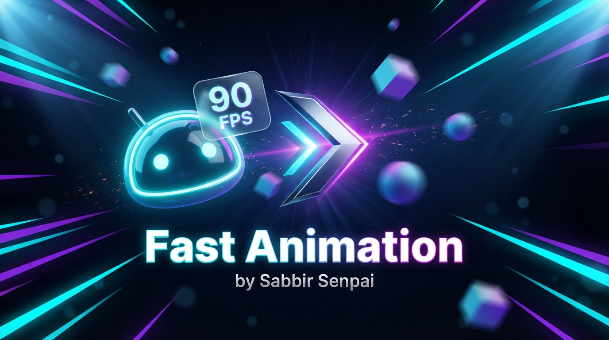

<div align="center">


# ⚡ Fast Animation & Stable FPS 💥

**Make your rooted Android buttery smooth — force GPU rendering, kill HW overlays, and boost animation speed for gaming.** 🎮


</div>

---

## ✨ Features

| | Feature | Description |
|---|---|---|
| 🚀 | **Force GPU Rendering** | Disable HW overlay via SurfaceFlinger |
| ⚡ | **0.5× Animation Speed** | Window, transition, animator scaled down |
| 📱 | **90Hz Refresh Lock** | Smooth scrolling on supported displays |
| 🧠 | **VM Swappiness Tuned** | Balanced memory pressure |
| 🎮 | **Gaming Optimized** | Less stutter, faster UI response |
| 🧹 | **Recent Apps Cleanup** | Clears recents on boot for fresh start |
| 🛡️ | **Safe & Reversible** | Disable module & reboot to restore |

---

## ⚙️ What It Does

| Tweak | Effect |
|-------|--------|
| `peak_refresh_rate = 90` | Max refresh capped at 90Hz |
| `min_refresh_rate = 0` | Adaptive min refresh |
| `user_refresh_rate = 90` | User-facing refresh 90Hz |
| `window_animation_scale = 0.5` | 2× faster window animations |
| `transition_animation_scale = 0.5` | 2× faster transitions |
| `animator_duration_scale = 0.5` | 2× faster animators |
| `vm.swappiness = 50` | Balanced memory tuning |
| `SurfaceFlinger 1008 i32 1` | HW overlay disabled → GPU render |

> ✅ Applied automatically **after boot completes** via `service.sh`

---

## 📱 Compatibility

<div align="center">


</div>

- ✅ Android **8.0** and higher
- ✅ Works on all mainstream brands
- ✅ Transsion optimized (XOS · HiOS · itelOS)

---

## 🚀 Installation

### Requirements
- Rooted device with **Magisk v20.4+**, **KernelSU**, or **APatch**
- Android 8.0+

### Steps
1. 📥 Download the latest `.zip` from [**Releases**](../../releases/latest)
2. 🔧 Open **Magisk / KernelSU / APatch**
3. 📂 Go to **Modules → Install from storage**
4. ✅ Select the zip
5. ⏳ Wait for flashing UI to finish
6. 🔄 **Reboot** your device

---

## ✅ Verify

After reboot, open Termux / ADB shell:

```sh
settings get global window_animation_scale
settings get global transition_animation_scale
settings get global animator_duration_scale
settings get system peak_refresh_rate
```

Expected output: `0.5` · `0.5` · `0.5` · `90`

---

## 🗑️ Uninstall

1. Open **Magisk / KernelSU / APatch**
2. Go to **Modules**
3. Find **Fast Animation** → tap **Remove**
4. **Reboot**

> ✅ All tweaks revert automatically. No data loss.

---

## ⚠️ Disclaimer

> Educational & personal use only. Not responsible for device damage or data loss. **Use at your own risk.**

---

<div align="center">

### 🌟 If this project helped you, don't forget to star the repo! 🌟

**Made with ❤️ by Sabbir Senpai 😎**

---

### ❤️ From Bangladesh 🇧🇩
### ✊ Free Palestine 🇵🇸

<br>


</div>
